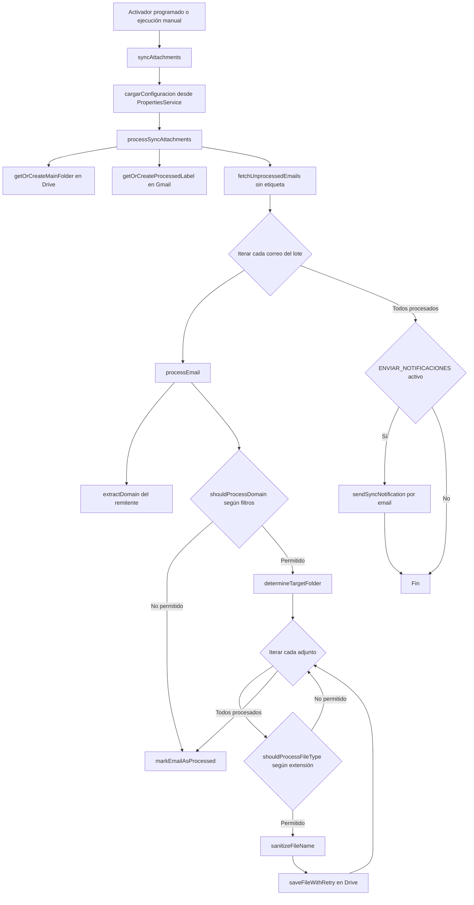
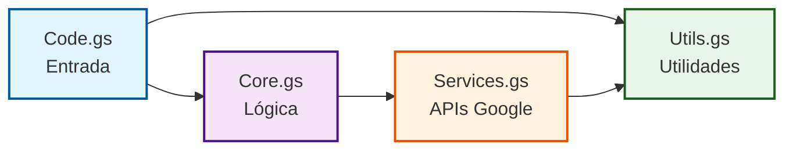

# ATTACH GMAIL

Sincronización automatizada de adjuntos de Gmail a Google Drive con organización inteligente por dominio del remitente.

**Desarrollado por [686f6c61](https://github.com/686f6c61)**

**Versión**: 1.1.0
**Licencia**: MIT
**Fecha**: 2025-11-17

---

## TABLA DE CONTENIDOS

- [Descripción](#descripción)
- [Características](#características)
- [Requisitos](#requisitos)
- [Instalación](#instalación)
- [Configuración](#configuración)
- [Arquitectura del proyecto](#arquitectura-del-proyecto)
- [Uso](#uso)
- [Seguridad](#seguridad)
- [Solución de problemas](#solución-de-problemas)
- [Contribuir](#contribuir)
- [Licencia](#licencia)
- [Contacto](#contacto)

---

## DESCRIPCIÓN

Attach GMAIL es una aplicación desarrollada con Google Apps Script que permite automatizar completamente la descarga y organización de adjuntos recibidos por correo electrónico en Gmail. El sistema sincroniza los archivos adjuntos directamente con Google Drive, organizándolos de forma inteligente según el remitente del correo electrónico.

La aplicación está diseñada para ejecutarse de forma autónoma mediante activadores programados, procesando correos electrónicos de manera periódica sin intervención del usuario. Cada correo electrónico con adjuntos se analiza automáticamente: se extrae el dominio del remitente, se validan los tipos de archivo según las reglas configuradas, y los archivos se guardan en carpetas organizadas jerárquicamente en Google Drive.

El sistema implementa una arquitectura modular que separa claramente las responsabilidades del código en cuatro módulos principales, facilitando el mantenimiento y la extensibilidad. Además, incorpora mecanismos robustos de validación de entradas, sanitización de nombres de archivos, manejo de errores con reintentos automáticos, y un sistema de caché que optimiza las llamadas a las APIs de Google.

### CASOS DE USO PRÁCTICOS

Este proyecto es especialmente útil en los siguientes escenarios profesionales y personales:

**Gestión empresarial**: Las empresas que reciben facturas, presupuestos o contratos por correo electrónico pueden automatizar completamente su archivo. Los documentos se organizan automáticamente por proveedor o cliente en carpetas específicas, facilitando la auditoría y búsqueda posterior.

**Recursos humanos**: Los departamentos de selección de personal que reciben currículums vitae y cartas de presentación por correo electrónico pueden centralizar todos los documentos en Drive, organizados por candidato y fecha de recepción.

**Respaldo de datos**: Los usuarios que desean mantener un respaldo automático de todos los adjuntos importantes recibidos pueden configurar el sistema para guardar copias de seguridad periódicas, liberando espacio en la cuenta de Gmail.

**Organización por proyectos**: Los profesionales que trabajan en múltiples proyectos simultáneamente pueden utilizar patrones de asunto del correo electrónico para organizar automáticamente los adjuntos en carpetas específicas de cada proyecto.

**Archivo documental**: Las organizaciones que necesitan mantener registros históricos de documentos recibidos por correo electrónico pueden implementar un sistema de archivo automático que preserve la trazabilidad temporal y la procedencia de cada documento.

---

## CARACTERÍSTICAS

### SINCRONIZACIÓN AUTOMÁTICA

El sistema procesa correos electrónicos de Gmail de forma completamente automática mediante activadores programados. Puede configurarse para ejecutarse cada hora, diariamente, semanalmente o con la frecuencia que el usuario determine. Cada ejecución procesa un lote configurable de correos electrónicos pendientes, extrae los adjuntos, los valida y los guarda en Google Drive.

El proceso de sincronización es incremental: el sistema marca cada correo electrónico procesado con una etiqueta específica de Gmail, evitando procesar dos veces el mismo mensaje. Esta estrategia permite ejecutar el script de forma segura múltiples veces sin generar duplicados.

### ORGANIZACIÓN INTELIGENTE

Los adjuntos se organizan automáticamente en una estructura jerárquica de carpetas en Google Drive siguiendo un esquema lógico que facilita la búsqueda y recuperación posterior:

Primero, el sistema extrae el dominio del correo electrónico del remitente. Por ejemplo, si recibe un correo desde contacto@empresa.com, el dominio extraído será empresa.com. Dentro de la carpeta principal de Attach GMAIL, se crea una subcarpeta con el nombre del dominio.

Para dominios genéricos comúnmente utilizados por usuarios individuales, como gmail.com, outlook.com o yahoo.com, el sistema puede configurarse para crear carpetas más específicas usando el nombre de usuario completo. Por ejemplo, en lugar de crear una carpeta genérica gmail.com donde se mezclarían adjuntos de múltiples remitentes, el sistema crearía carpetas separadas como juan.perez@gmail.com y maria.lopez@gmail.com.

Dentro de cada carpeta de dominio o usuario, el sistema crea subcarpetas específicas para cada correo electrónico procesado. El nombre de estas subcarpetas combina la fecha de recepción del correo con una versión resumida del asunto, por ejemplo: 2025-11-17 - Factura servicios noviembre. Esta estructura permite localizar rápidamente adjuntos específicos navegando por fecha y contexto.

### FILTRADO AVANZADO POR DOMINIOS

El sistema implementa un mecanismo flexible de filtrado que permite controlar exactamente qué correos electrónicos se procesan según el dominio del remitente:

**Listas de inclusión**: Es posible especificar una lista de dominios permitidos. Si se configura esta lista, únicamente se procesarán correos electrónicos provenientes de esos dominios. Por ejemplo, configurando cliente1.com, cliente2.com, proveedor.com como dominios incluidos, el sistema ignorará todos los demás remitentes.

**Listas de exclusión**: Alternativamente, se puede especificar una lista de dominios bloqueados. Los correos de estos dominios serán ignorados automáticamente. Esta opción es útil para filtrar spam, publicidad o remitentes no deseados.

**Combinación de reglas**: El sistema permite usar simultáneamente listas de inclusión y exclusión. Las exclusiones siempre tienen prioridad: si un dominio aparece en ambas listas, será bloqueado.

**Comodines**: El sistema soporta patrones con asterisco para dominios. Por ejemplo, *.empresa.com coincidirá con todos los subdominios como ventas.empresa.com, soporte.empresa.com, etc.

### FILTRADO POR TIPOS DE ARCHIVO

Los adjuntos pueden filtrarse según su extensión, permitiendo procesar únicamente los formatos de archivo relevantes para cada caso de uso:

**Extensiones permitidas**: Se puede configurar una lista de extensiones específicas que el sistema procesará. Por ejemplo, configurando pdf, docx, xlsx únicamente se guardarán documentos PDF, Word y Excel, ignorando imágenes, vídeos u otros formatos.

**Extensiones excluidas**: Alternativamente, se puede especificar qué extensiones deben ignorarse. Por ejemplo, excluyendo exe, bat, com se evita guardar archivos ejecutables potencialmente peligrosos.

**Interfaz con chips**: La aplicación web proporciona una interfaz visual con chips interactivos para los tipos de archivo más comunes, facilitando la selección sin necesidad de escribir manualmente las extensiones.

### PATRONES DE ASUNTO

El sistema puede extraer patrones específicos del asunto del correo electrónico para crear carpetas temáticas. Esta funcionalidad es especialmente útil cuando los correos electrónicos incluyen identificadores de proyecto, números de factura o códigos de referencia en el asunto.

Por ejemplo, si se configura el patrón PROYECTO-123 y se reciben correos con asuntos como PROYECTO-123: Actualización semanal o Documentación PROYECTO-123, el sistema creará una carpeta específica llamada PROYECTO-123 donde se centralizarán todos los adjuntos relacionados con ese proyecto.

El sistema normaliza los patrones para reconocerlos independientemente de mayúsculas, minúsculas o acentos, garantizando que todas las variaciones del mismo patrón se agrupen correctamente.

### NOTIFICACIONES POR CORREO ELECTRÓNICO

El sistema puede enviar resúmenes periódicos por correo electrónico con estadísticas detalladas de la sincronización:

**Frecuencia configurable**: Diaria, semanal, quincenal, mensual o desactivada completamente.

**Niveles de detalle**: Básico (resumen general con número de correos y adjuntos procesados) o Detallado (incluye desglose por dominio, tipos de archivo procesados, errores encontrados).

**Notificaciones de error**: Si ocurre un error crítico durante la sincronización, el sistema envía inmediatamente una notificación con los detalles del problema para facilitar la depuración.

### INTERFAZ MATERIAL DESIGN

La aplicación web implementa los principios de Material Design de Google, proporcionando una experiencia de usuario moderna, intuitiva y visualmente coherente:

**Paleta monocromática**: Diseño profesional en tonos de blanco y negro que garantiza legibilidad y accesibilidad.

**Componentes Material**: Utiliza tarjetas, chips, botones elevados y campos de texto siguiendo las especificaciones oficiales de Material Design.

**Diseño responsive**: La interfaz se adapta automáticamente a diferentes tamaños de pantalla, funcionando correctamente en dispositivos móviles, tabletas y ordenadores.

**Animaciones suaves**: Transiciones y efectos visuales sutiles que mejoran la retroalimentación del usuario sin distraer.

**Material Icons**: Iconografía consistente proveniente de la biblioteca oficial de iconos de Google.

### SISTEMA DE LOGGING ESTRUCTURADO

El sistema implementa un mecanismo robusto de registro de eventos que facilita el diagnóstico de problemas y la auditoría de operaciones:

**Niveles de registro**: INFO (operaciones normales), WARN (situaciones anómalas no críticas), ERROR (fallos que requieren atención).

**Registro en consola**: Todos los eventos se registran en la consola de Google Apps Script con marca temporal y contexto detallado.

**Persistencia de errores**: Los errores críticos se guardan automáticamente en PropertiesService, manteniendo un histórico de los últimos 50 errores para análisis posterior.

**Consulta desde interfaz**: La aplicación web permite consultar directamente los registros de errores guardados sin necesidad de acceder al editor de scripts.

### OPTIMIZACIÓN DE RENDIMIENTO

El sistema implementa varias estrategias de optimización para minimizar el tiempo de ejecución y el consumo de cuota de API:

**Caché de carpetas**: Las búsquedas de carpetas en Drive se almacenan en caché durante la ejecución, reduciendo aproximadamente un 50% las llamadas a la API de Drive.

**Reintentos con retroceso exponencial**: Si una operación de API falla por límites de tasa o errores transitorios, el sistema reintenta automáticamente hasta tres veces con esperas crecientes (1s, 2s, 4s).

**Procesamiento por lotes**: El número de correos procesados por ejecución es configurable, permitiendo ajustar el balance entre rapidez y riesgo de exceder límites de tiempo de ejecución.

---

## REQUISITOS

Para utilizar Attach GMAIL es necesario cumplir los siguientes requisitos técnicos:

**Cuenta de Google**: Se requiere una cuenta de Google activa con acceso tanto a Gmail como a Google Drive. El script se ejecutará en el contexto de esta cuenta, procesando sus correos electrónicos y guardando archivos en su Drive.

**Espacio en Google Drive**: Suficiente espacio de almacenamiento disponible en Drive para guardar los adjuntos. El espacio necesario dependerá del volumen y tamaño de adjuntos que reciba.

**Navegador web moderno**: Un navegador actualizado compatible con las herramientas de Google (Chrome, Firefox, Safari, Edge). Se recomienda especialmente Chrome por su integración nativa con los servicios de Google.

**Conocimientos básicos de Google Apps Script**: Familiaridad básica con la interfaz del editor de Apps Script para copiar archivos, autorizar permisos y configurar activadores. No se requieren conocimientos avanzados de programación.

**Permisos de OAuth**: Disposición para autorizar los permisos de lectura de Gmail, modificación de etiquetas, creación de archivos en Drive y envío de correos electrónicos. El usuario debe revisar y aceptar estos permisos durante la instalación.

---

## INSTALACIÓN

El proceso de instalación consiste en crear un proyecto de Google Apps Script, copiar los archivos del código, autorizar los permisos necesarios y desplegar la aplicación web.

### MÉTODO 1: INSTALACIÓN MANUAL

Este método es recomendado para usuarios que prefieren control total sobre el proceso y no tienen experiencia con herramientas de línea de comandos.

#### PASO 1: CREAR PROYECTO DE GOOGLE APPS SCRIPT

Acceda a la consola de Google Apps Script en https://script.google.com utilizando su cuenta de Google. Haga clic en el botón Nuevo proyecto ubicado en la esquina superior izquierda. El sistema creará un proyecto vacío con un archivo Code.gs predeterminado.

Renombre el proyecto haciendo clic en el título predeterminado Proyecto sin título en la parte superior. Asigne un nombre descriptivo como Attach GMAIL v1.1.0 o Sincronización adjuntos Gmail.

#### PASO 2: COPIAR ARCHIVOS DEL CÓDIGO

Elimine el archivo Code.gs predeterminado que viene con el proyecto nuevo, ya que será reemplazado por la versión de este repositorio.

Cree los siguientes archivos de script haciendo clic en el botón + junto a Archivos y seleccionando Script:

**Code.gs**: Copie el contenido completo del archivo Code.gs desde este repositorio. Este archivo contiene los puntos de entrada principales y la configuración del sistema.

**Utils.gs**: Cree un nuevo archivo de script llamado Utils.gs y copie su contenido desde el repositorio. Este módulo contiene todas las funciones utilitarias, validadores y el sistema de logging.

**Services.gs**: Cree Services.gs y copie su contenido. Este módulo gestiona todas las interacciones con las APIs de Gmail y Drive.

**Core.gs**: Cree Core.gs y copie su contenido. Este módulo implementa la lógica principal de procesamiento de correos electrónicos y adjuntos.

Para crear el archivo HTML de la interfaz, haga clic en el botón + junto a Archivos y seleccione HTML. Nómbrelo UI.html y copie el contenido completo del archivo UI.html desde el repositorio.

Guarde todos los cambios haciendo clic en el icono de disco o utilizando Ctrl+S.

#### PASO 3: AUTORIZAR PERMISOS

Antes de poder utilizar la aplicación, debe autorizar los permisos que el script necesita para acceder a Gmail y Drive.

En el editor de Apps Script, localice el menú desplegable de funciones en la parte superior de la pantalla (donde dice Seleccionar función). Seleccione la función doGet de la lista.

Haga clic en el botón Ejecutar (icono de triángulo play). La primera vez que ejecute el script, aparecerá un mensaje indicando que necesita autorización.

Haga clic en Revisar permisos. Google mostrará una pantalla de advertencia indicando que la aplicación no está verificada, ya que es un script personal. Haga clic en Configuración avanzada en la parte inferior y luego en Ir a Attach GMAIL (no seguro).

Revise cuidadosamente los permisos solicitados:
- Ver y gestionar sus correos electrónicos de Gmail
- Ver y administrar aplicaciones de etiquetas de Gmail
- Ver, editar, crear y eliminar archivos de Google Drive
- Enviar correos electrónicos en su nombre
- Guardar configuración en PropertiesService

Si está de acuerdo con estos permisos, haga clic en Permitir. Los permisos quedarán guardados y no será necesario volver a autorizarlos.

#### PASO 4: DESPLEGAR COMO APLICACIÓN WEB

Para acceder a la interfaz gráfica desde el navegador, debe desplegar el proyecto como aplicación web.

En el editor de Apps Script, haga clic en el botón Implementar en la esquina superior derecha y seleccione Nueva implementación.

En el diálogo que aparece, haga clic en el icono de engranaje junto a Tipo y seleccione Aplicación web.

Configure los siguientes parámetros:

**Descripción**: Opcional, puede escribir Attach GMAIL v1.1.0 o dejar vacío.

**Ejecutar como**: Seleccione Yo. Esto garantiza que el script se ejecute con sus permisos, accediendo a su Gmail y Drive.

**Quién tiene acceso**: Seleccione Solo yo. Esto garantiza que únicamente usted puede acceder a la aplicación web, protegiendo sus datos.

Haga clic en Implementar. El sistema generará una URL única para su aplicación web. Copie esta URL y guárdela en un lugar seguro, será la que utilice para acceder a la interfaz de configuración.

La URL tendrá un formato similar a: https://script.google.com/macros/s/XXXXXX/exec

### MÉTODO 2: INSTALACIÓN CON CLASP

Este método es recomendado para desarrolladores familiarizados con herramientas de línea de comandos. CLASP (Command Line Apps Script Projects) permite gestionar proyectos de Apps Script desde la terminal.

#### REQUISITOS PREVIOS

Instale Node.js en su sistema si no lo tiene instalado. Puede descargarlo desde https://nodejs.org

Instale CLASP globalmente utilizando npm:

```bash
npm install -g @google/clasp
```

#### PROCESO DE INSTALACIÓN

Clone el repositorio de GitHub en su máquina local:

```bash
git clone https://github.com/686f6c61/attach-gmail-google-script.git
cd attach-gmail-google-script
```

Inicie sesión en su cuenta de Google mediante CLASP:

```bash
clasp login
```

Se abrirá una ventana del navegador solicitando que autorice CLASP para acceder a su cuenta de Google Apps Script. Autorice el acceso.

Cree un nuevo proyecto de Apps Script vinculado a la carpeta actual:

```bash
clasp create --title "Attach GMAIL v1.1.0" --rootDir .
```

Este comando creará un archivo .clasp.json en la carpeta con la configuración del proyecto.

Suba todos los archivos del código al proyecto de Apps Script:

```bash
clasp push
```

CLASP sincronizará todos los archivos .gs y .html con el proyecto en la nube.

Abra el proyecto en el editor web de Apps Script para completar la autorización y el despliegue:

```bash
clasp open
```

Una vez en el editor web, siga los pasos 3 y 4 del Método 1 (Autorizar permisos y Desplegar como aplicación web).

---

## CONFIGURACIÓN

La configuración del sistema se realiza principalmente a través de la interfaz web, aunque también es posible modificar valores directamente desde el código para usuarios avanzados.

### ACCESO A LA INTERFAZ DE CONFIGURACIÓN

Abra en su navegador la URL de la aplicación web que obtuvo durante el despliegue. La interfaz mostrará un panel de configuración organizado en secciones temáticas con formularios intuitivos.

### PARÁMETROS DE SINCRONIZACIÓN

**Nombre de la carpeta principal en Drive**: Especifica el nombre de la carpeta raíz que se creará en Drive para almacenar todos los adjuntos. Por defecto es Attach GMAIL. Dentro de esta carpeta se crearán automáticamente las subcarpetas organizadas por dominio y fecha.

**Nombre de la etiqueta de Gmail**: Define el nombre de la etiqueta que se aplicará a los correos electrónicos procesados para evitar procesarlos nuevamente. Por defecto es Attach/Procesado. El sistema la creará automáticamente si no existe.

**Máximo de correos a procesar por ejecución**: Controla cuántos correos electrónicos se procesarán en cada ejecución del script. Un valor entre 50 y 100 es recomendable para balancear rapidez y riesgo de exceder el tiempo máximo de ejecución de Apps Script (6 minutos). El valor máximo permitido es 500, pero valores altos pueden causar timeouts si los correos tienen muchos adjuntos pesados.

**Días hacia atrás para buscar correos**: Especifica cuántos días hacia el pasado debe buscar el script al obtener correos electrónicos no procesados. Un valor de 0 significa sin límite, procesando todos los correos históricos que aún no tengan la etiqueta de procesado. Un valor de 7, por ejemplo, procesará únicamente correos de la última semana.

### FILTRADO POR DOMINIOS

El sistema permite definir listas de dominios para controlar exactamente qué remitentes se procesan.

**Dominios incluidos**: Escriba los dominios separados por comas, por ejemplo: empresa1.com, cliente2.com, proveedor3.com. Si esta lista contiene al menos un dominio, únicamente se procesarán correos de estos dominios. Si se deja vacía, se procesarán todos los dominios excepto los explícitamente excluidos.

**Dominios excluidos**: Escriba los dominios que desea bloquear, separados por comas, por ejemplo: spam.com, publicidad.com. Los correos de estos dominios serán ignorados automáticamente. Las exclusiones tienen prioridad sobre las inclusiones.

**Uso de dominios genéricos con nombre de usuario**: Active esta opción para que los dominios comunes de correo personal (gmail.com, outlook.com, yahoo.com, hotmail.com) se organicen usando el nombre de usuario completo en lugar del dominio genérico. Por ejemplo, se creará una carpeta juan.perez@gmail.com en lugar de gmail.com, evitando mezclar adjuntos de múltiples contactos personales.

### FILTRADO POR TIPOS DE ARCHIVO

El sistema permite controlar qué extensiones de archivo se guardan y cuáles se ignoran.

**Extensiones permitidas**: Especifique las extensiones que desea procesar, separadas por comas, por ejemplo: pdf, docx, xlsx, pptx, jpg, png. Si esta lista contiene al menos una extensión, únicamente se guardarán archivos con estas extensiones. Si se deja vacía, se procesarán todas las extensiones excepto las explícitamente excluidas.

**Extensiones excluidas**: Especifique las extensiones que desea ignorar, por ejemplo: exe, bat, com, dll. Los archivos con estas extensiones no se guardarán. Las exclusiones tienen prioridad sobre las inclusiones.

La interfaz proporciona chips interactivos para los tipos de archivo más comunes, permitiendo activarlos o desactivarlos con un clic sin necesidad de escribir manualmente las extensiones.

### PATRONES DE ASUNTO

**Activar organización por patrones de asunto**: Active esta opción para permitir que el sistema extraiga patrones del asunto del correo electrónico y los utilice para crear carpetas temáticas.

**Patrones a buscar**: Escriba las palabras clave o códigos que desea buscar en los asuntos, separados por comas, por ejemplo: FACTURA, PROYECTO-A, CONTRATO. El sistema normalizará estos patrones y creará carpetas específicas cuando los encuentre en el asunto de un correo.

### NOTIFICACIONES

**Enviar notificaciones por correo electrónico**: Active esta opción para recibir resúmenes periódicos de la sincronización en su correo electrónico.

**Frecuencia de notificaciones**: Seleccione la periodicidad con la que desea recibir resúmenes: Diaria, Semanal, Quincenal, Mensual o Nunca.

**Nivel de detalle**: Seleccione Básico para recibir únicamente un resumen con números totales, o Detallado para incluir desglose por dominio, tipos de archivo y errores encontrados.

### GUARDAR CONFIGURACIÓN

Una vez completados todos los parámetros deseados, haga clic en el botón Guardar configuración en la parte inferior de la interfaz. El sistema validará todos los valores, mostrará un mensaje de confirmación y guardará la configuración en PropertiesService.

La configuración guardada persiste entre ejecuciones del script y se carga automáticamente cada vez que se ejecuta una sincronización.

### CAPTURAS DE PANTALLA DE LA INTERFAZ

A continuación se muestran capturas de pantalla de las diferentes secciones de la interfaz de configuración:

#### CONFIGURACIÓN DE SINCRONIZACIÓN


Esta sección permite configurar los parámetros básicos de sincronización: nombre de la carpeta principal en Drive, etiqueta de Gmail para correos procesados, número máximo de correos por ejecución y límite temporal de búsqueda.

#### FILTRADO POR DOMINIOS Y TIPO DE ARCHIVO


Interfaz para configurar el filtrado avanzado por dominios de remitente y tipos de archivo. Incluye chips interactivos para seleccionar rápidamente los formatos de archivo más comunes.

#### NOTIFICACIONES


Panel de configuración de notificaciones por correo electrónico, con opciones de frecuencia y nivel de detalle de los resúmenes enviados.

#### ZONA DE PELIGRO


Sección de acciones críticas que permite restablecer la configuración, eliminar la carpeta principal de Drive o resetear las etiquetas de correos procesados.

---

## ARQUITECTURA DEL PROYECTO

El proyecto implementa una arquitectura modular que separa claramente las responsabilidades en diferentes archivos, facilitando el mantenimiento, la comprensión del código y la extensibilidad futura.

### ESTRUCTURA DE ARCHIVOS

El proyecto está compuesto por cinco archivos principales:

```
attach-gmail-google-script/
├── Code.gs          (250 líneas) - Puntos de entrada y configuración
├── Utils.gs         (380 líneas) - Utilidades, validadores y logger
├── Services.gs      (450 líneas) - Operaciones con APIs de Google
├── Core.gs          (300 líneas) - Lógica de procesamiento principal
├── UI.html          (750 líneas) - Interfaz de usuario Material Design
├── README.md        - Documentación del proyecto
└── SECURITY.md      - Política de seguridad
```

Cada archivo tiene una responsabilidad única y bien definida, siguiendo el principio de separación de intereses (Separation of Concerns).

### DIAGRAMA DE FLUJO DE SINCRONIZACIÓN

El siguiente diagrama muestra el flujo completo de ejecución desde que se activa la sincronización hasta que se completa:



### DIAGRAMA DE DEPENDENCIAS ENTRE MÓDULOS

Este diagrama ilustra cómo se relacionan los diferentes módulos del proyecto:



**Flujo de dependencias**:
1. Code.gs actúa como punto de entrada, llamando a Core.gs y Utils.gs
2. Core.gs implementa la lógica principal, delegando operaciones de API a Services.gs
3. Services.gs realiza las llamadas a Gmail y Drive, usando Utils.gs para validación
4. Utils.gs no depende de ningún otro módulo, proporcionando funciones puras

### DESCRIPCIÓN DETALLADA DE MÓDULOS

#### CODE.GS - PUNTOS DE ENTRADA Y CONFIGURACIÓN

Este módulo define los puntos de entrada principales del sistema y gestiona la configuración persistente.

**Funciones principales**:

`doGet()`: Función requerida por Google Apps Script para servir la aplicación web. Carga el archivo UI.html y lo devuelve al navegador del usuario.

`syncAttachments()`: Punto de entrada principal para la sincronización completa. Carga la configuración guardada, ejecuta el proceso completo de sincronización y devuelve estadísticas.

`testSync()`: Versión de prueba de la sincronización que procesa únicamente 5 correos electrónicos, independientemente de la configuración. Útil para verificar que el sistema funciona correctamente sin procesar grandes volúmenes.

`cargarConfiguracion()`: Carga la configuración guardada desde PropertiesService y la asigna al objeto global CONFIG. Si no existe configuración guardada, utiliza valores predeterminados.

`guardarConfiguracion(config)`: Valida y guarda un objeto de configuración en PropertiesService. Incluye validación completa de todos los parámetros antes de persistir.

`cambiarConfiguracion(changes)`: Función específica para modificar parámetros individuales de la configuración sin tener que pasar el objeto completo. Carga la configuración actual, aplica los cambios, valida y guarda.

**Objeto CONFIG global**: Contiene todos los parámetros de configuración del sistema. Se carga al inicio de cada ejecución y se utiliza en todos los módulos.

#### UTILS.GS - UTILIDADES, VALIDADORES Y LOGGER

Este módulo proporciona funciones utilitarias reutilizables, validadores de entrada y el sistema de logging estructurado.

**Utilidades de texto**:

`normalizeText(text)`: Normaliza texto eliminando acentos, caracteres especiales y símbolos no seguros para nombres de archivos o carpetas. Reemplaza caracteres como /, \, :, *, ?, ", <, >, | por guiones bajos. Limita la longitud a 255 caracteres.

`extractDomain(emailString)`: Extrae el dominio y el nombre de usuario de una dirección de correo electrónico, manejando formatos como Nombre Apellido <email@dominio.com> o simplemente email@dominio.com.

`getFileExtension(fileName)`: Obtiene la extensión de un archivo a partir de su nombre, devolviendo la parte después del último punto.

`formatDate(date, format)`: Formatea objetos Date según patrones como yyyy-MM-dd HH:mm:ss, utilizando la zona horaria del script.

`truncateString(str, maxLength)`: Trunca un string a una longitud máxima especificada.

**Filtros**:

`shouldProcessDomain(domain)`: Verifica si un dominio debe procesarse según las listas de dominios incluidos y excluidos configuradas. Las exclusiones tienen prioridad.

`shouldProcessFileType(fileName)`: Verifica si un tipo de archivo debe procesarse según las listas de extensiones permitidas y excluidas.

`matchesPattern(value, patterns)`: Verifica si un valor coincide con algún patrón de una lista, soportando comodines con asterisco.

**Validadores**:

`validateConfig(config)`: Valida un objeto de configuración completo, verificando tipos de datos, rangos de valores y formatos. Lanza excepciones con mensajes descriptivos si encuentra errores.

`sanitizeFileName(fileName)`: Sanitiza un nombre de archivo, verificando que no sea vacío, no exceda 255 caracteres y no contenga caracteres peligrosos.

`sanitizeLabelName(labelName)`: Sanitiza nombres de etiquetas de Gmail para usarlos de forma segura en consultas, escapando comillas y barras invertidas.

**Sistema de logging**:

`log(level, message, data)`: Función principal de logging que registra mensajes con niveles INFO, WARN o ERROR. Los mensajes se imprimen en consola con formato estructurado y los errores se guardan automáticamente en PropertiesService.

`saveErrorLog(logEntry)`: Guarda entradas de log de errores en PropertiesService, manteniendo un histórico de los últimos 50 errores para auditoría.

`getUsername()`: Obtiene el nombre de usuario del correo electrónico de la cuenta activa, útil para personalizar mensajes.

#### SERVICES.GS - OPERACIONES CON APIS DE GOOGLE

Este módulo encapsula todas las interacciones con las APIs de Gmail y Drive, implementando caché, reintentos automáticos y manejo robusto de errores.

**Operaciones de Gmail**:

`fetchUnprocessedEmails(processedLabel)`: Busca correos electrónicos que aún no tienen la etiqueta de procesado. Construye una consulta segura de Gmail filtrando por etiqueta y días hacia atrás. Devuelve un array de mensajes de Gmail.

`getOrCreateProcessedLabel()`: Obtiene la etiqueta de Gmail configurada para marcar correos procesados. Si no existe, la crea automáticamente.

`countPendingEmails()`: Cuenta cuántos correos electrónicos pendientes quedan sin procesar, útil para estadísticas.

**Operaciones de Drive**:

`getOrCreateMainFolder()`: Obtiene la carpeta principal configurada en Drive. Si no existe, la crea en la raíz del Drive del usuario.

`getOrCreateFolder(folderName, parentFolder)`: Obtiene o crea una carpeta con un nombre específico dentro de una carpeta padre. Implementa caché para evitar búsquedas repetidas de la misma carpeta durante una ejecución.

`fileExistsInFolder(folder, fileName)`: Verifica si un archivo con un nombre específico ya existe en una carpeta, evitando duplicados.

`saveFileWithRetry(folder, blob, fileName, maxRetries)`: Guarda un archivo en Drive con reintentos automáticos. Si la operación falla por límites de tasa o errores transitorios, reintenta hasta tres veces con retroceso exponencial (esperas de 1s, 2s, 4s).

**Caché de carpetas**: El módulo mantiene un objeto FOLDER_CACHE que almacena referencias a carpetas ya buscadas, reduciendo drásticamente el número de llamadas a la API de Drive.

**Notificaciones**:

`sendSyncNotification(stats)`: Envía un correo electrónico con un resumen de la sincronización, incluyendo estadísticas detalladas si está configurado.

`sendErrorNotification(error)`: Envía un correo electrónico inmediato cuando ocurre un error crítico durante la sincronización.

**Gestión de activadores**:

`setupTrigger(config)`: Configura activadores programados de Apps Script según la frecuencia especificada en la configuración.

#### CORE.GS - LÓGICA DE PROCESAMIENTO PRINCIPAL

Este módulo implementa la lógica central del sistema, orquestando el proceso completo de sincronización.

**Sincronización principal**:

`processSyncAttachments()`: Función principal que ejecuta el ciclo completo de sincronización. Inicializa estadísticas, obtiene la carpeta principal y la etiqueta, busca correos no procesados, itera cada correo llamando a processEmail, actualiza estadísticas y envía notificaciones si está configurado. Incluye manejo robusto de errores con try-catch.

**Procesamiento de correos**:

`processEmail(email, mainFolder, processedLabel)`: Procesa un correo electrónico individual. Extrae el dominio del remitente, verifica si debe procesarse según filtros, determina la carpeta de destino, itera cada adjunto validando tipos de archivo, sanitiza nombres y guarda los archivos. Marca el correo como procesado al finalizar, incluso si no tiene adjuntos válidos.

`markEmailAsProcessed(email, label)`: Aplica la etiqueta de procesado al hilo del correo electrónico para evitar procesarlo nuevamente en futuras ejecuciones.

**Determinación de carpetas**:

`determineTargetFolder(mainFolder, email, domainInfo)`: Determina la carpeta de destino para los adjuntos de un correo específico. Implementa la estrategia de organización: primero intenta usar patrones de asunto si está configurado, luego usa dominio o usuario@dominio según configuración, y finalmente crea una subcarpeta específica para el correo con fecha y asunto.

`createEmailSubfolder(baseFolder, email)`: Crea una subcarpeta específica para un correo dentro de la carpeta base, usando el formato yyyy-MM-dd - Asunto resumido.

`extractSubjectPattern(subject)`: Extrae patrones configurados del asunto del correo electrónico, normalizando el texto para reconocer variaciones de mayúsculas y acentos.

#### UI.HTML - INTERFAZ DE USUARIO MATERIAL DESIGN

Este archivo HTML contiene la interfaz web completa de la aplicación, implementando Material Design con CSS y JavaScript inline.

**Estructura**:

La interfaz está organizada en secciones temáticas dentro de tarjetas Material, cada una con su título, descripción y formularios correspondientes.

**Componentes Material implementados**:

Cards (tarjetas) para agrupar secciones relacionadas, Chips interactivos para selección de tipos de archivo, Text fields con diseño Material, Buttons elevados con efectos ripple, Switches para opciones booleanas, Select dropdowns para opciones múltiples.

**Paleta de colores monocromática**:

La interfaz utiliza exclusivamente tonos de blanco, negro y grises, creando un diseño profesional y accesible. Los colores primarios son negro #000000 y el fondo es blanco #ffffff, con grises intermedios para bordes y sombras.

**JavaScript funcional**:

El código JavaScript implementa la lógica de la interfaz: carga de configuración al abrir la página, validación de formularios, envío de datos al backend mediante google.script.run, manejo de respuestas asíncronas, actualización dinámica de la interfaz según selecciones del usuario.

**Responsive design**:

La interfaz utiliza flexbox y media queries para adaptarse automáticamente a diferentes tamaños de pantalla, garantizando usabilidad en dispositivos móviles y de escritorio.

### ORDEN DE CARGA EN GOOGLE APPS SCRIPT

Google Apps Script carga los archivos .gs en orden alfabético, creando un único contexto de ejecución global donde todas las funciones y variables son compartidas.

El orden de carga en este proyecto es:
1. Code.gs (define CONFIG y puntos de entrada)
2. Core.gs (define lógica principal)
3. Services.gs (define operaciones de API)
4. Utils.gs (define utilidades)

Este orden es seguro porque ningún archivo ejecuta código al cargarse, únicamente definen funciones. El código se ejecuta cuando se invoca explícitamente una función como syncAttachments().

---

## USO

Una vez completada la instalación y configuración, el sistema puede utilizarse de forma manual o automática.

### EJECUCIÓN MANUAL DESDE LA INTERFAZ WEB

Abra la URL de la aplicación web en su navegador. En la parte superior de la interfaz verá botones de acción:

**Ejecutar prueba**: Procesa únicamente 5 correos electrónicos, independientemente de la configuración. Esta opción es ideal para verificar que el sistema funciona correctamente antes de procesar grandes volúmenes. Haga clic en el botón, espere unos segundos y verá un mensaje de confirmación con las estadísticas de la prueba.

**Sincronización completa**: Procesa el número de correos configurado en MAX_EMAILS_TO_PROCESS. Esta opción se usa para ejecutar manualmente una sincronización completa cuando lo desee.

Después de cada ejecución, la interfaz mostrará un resumen con el número de correos procesados, adjuntos guardados, errores encontrados y tiempo de ejecución.

### EJECUCIÓN MANUAL DESDE EL EDITOR DE APPS SCRIPT

Abra el proyecto en el editor de Apps Script. En la parte superior, seleccione la función que desea ejecutar en el menú desplegable de funciones:

**syncAttachments**: Ejecuta la sincronización completa según configuración.

**testSync**: Ejecuta una prueba procesando 5 correos.

**obtenerEstadoPendientes**: Muestra cuántos correos pendientes quedan por procesar.

**obtenerLogsErrores**: Muestra el histórico de los últimos 50 errores guardados.

Haga clic en el botón Ejecutar (triángulo play). Los resultados aparecerán en la consola inferior o en el registro de ejecución.

### EJECUCIÓN AUTOMÁTICA CON ACTIVADORES

Para que el sistema funcione de forma completamente autónoma, configure activadores programados:

Acceda al editor de Apps Script y haga clic en el icono del reloj Activadores en el menú lateral izquierdo.

Haga clic en Añadir activador en la esquina inferior derecha.

Configure el activador con los siguientes parámetros:

**Elija qué función ejecutar**: Seleccione syncAttachments.

**Elija qué implementación se debe ejecutar**: Seleccione Head (versión más reciente).

**Seleccione el tipo de activador del evento**: Seleccione Basado en tiempo.

**Seleccione el tipo de activador de tiempo**: Puede elegir entre:
- Activador por temporizador (cada hora): El script se ejecutará cada hora.
- Activador de día (hora específica): El script se ejecutará una vez al día a la hora que especifique.
- Activador de semana (día y hora): El script se ejecutará una vez por semana en el día y hora especificados.
- Activador de mes (día y hora): El script se ejecutará una vez al mes.

Haga clic en Guardar. A partir de ese momento, el script se ejecutará automáticamente según la frecuencia configurada sin intervención manual.

### MONITOREO Y AUDITORÍA

Para verificar que las sincronizaciones automáticas están funcionando correctamente, puede utilizar varios métodos de monitoreo:

**Registros de ejecución**: En el editor de Apps Script, acceda a Ver > Registros o Ver > Ejecuciones. Aquí verá un historial completo de todas las ejecuciones del script, incluyendo las activadas automáticamente, con marca temporal, duración y estado (éxito o error).

**Notificaciones por correo electrónico**: Si ha configurado notificaciones, recibirá resúmenes periódicos en su correo con estadísticas detalladas de las sincronizaciones realizadas.

**Consulta de logs de errores**: Desde la interfaz web o ejecutando la función obtenerLogsErrores() en el editor, puede consultar el histórico de los últimos 50 errores con todos sus detalles.

**Verificación en Drive**: Revise periódicamente la carpeta principal en Drive para confirmar que los adjuntos se están guardando correctamente en la estructura de carpetas esperada.

### CONSIDERACIONES DE CUOTAS

Google Apps Script impone límites de cuota que deben tenerse en cuenta:

**Tiempo máximo de ejecución**: 6 minutos por ejecución. Si el procesamiento de correos excede este tiempo, la ejecución se detendrá. Para evitarlo, ajuste MAX_EMAILS_TO_PROCESS a un valor razonable (50-100).

**Activadores diarios**: Máximo 90 minutos de tiempo total de ejecución por día para activadores. Si ejecuta el script cada hora, cada ejecución no debe superar aproximadamente 3-4 minutos para no exceder la cuota diaria.

**Llamadas a APIs**: Límites de tasa de las APIs de Gmail y Drive. El sistema implementa reintentos automáticos con retroceso exponencial para manejar estos límites, pero si procesa volúmenes extremadamente altos, puede encontrar errores temporales de cuota.

---

## SEGURIDAD

La seguridad y privacidad de los datos son prioridades fundamentales en el diseño de Attach GMAIL.

### FILOSOFÍA DE SEGURIDAD Y PRIVACIDAD

El sistema implementa una arquitectura de privacidad por diseño que garantiza la protección de los datos del usuario:

**Ejecución local en la cuenta del usuario**: Todo el código se ejecuta exclusivamente en el contexto de la cuenta de Google del usuario. No existe ningún servidor externo ni tercero involucrado en el procesamiento de datos.

**Sin transmisión externa**: Los correos electrónicos, adjuntos y configuración nunca abandonan el ecosistema de Google del usuario. Los datos fluyen únicamente entre Gmail y Drive dentro de la misma cuenta.

**Código 100% auditable**: El código completo está disponible públicamente en GitHub bajo licencia MIT. Cualquier usuario o auditor puede revisar cada línea del código para verificar que no realiza operaciones indebidas.

**Sin recopilación de datos**: El sistema no recopila, registra ni transmite ningún tipo de estadística de uso, información personal o metadatos a desarrolladores o terceros.

### PERMISOS OAUTH REQUERIDOS

El sistema requiere autorización explícita del usuario para los siguientes ámbitos de permisos:

**gmail.readonly**: Permite al script leer correos electrónicos de la cuenta del usuario. Este permiso es necesario para buscar correos con adjuntos y extraer los archivos adjuntos.

**gmail.modify**: Permite al script modificar etiquetas de Gmail. Este permiso se utiliza únicamente para aplicar la etiqueta de procesado a los correos ya sincronizados, evitando procesarlos dos veces.

**drive**: Permite al script crear carpetas y archivos en Google Drive. Este permiso es necesario para guardar los adjuntos en la estructura de carpetas organizada.

**script.container.ui**: Permite mostrar la interfaz de usuario HTML dentro del contexto de Apps Script.

**script.send_mail**: Permite enviar correos electrónicos en nombre del usuario. Este permiso se utiliza únicamente para enviar las notificaciones de resumen si el usuario las ha configurado.

**script.storage**: Permite guardar datos de configuración en PropertiesService para persistir entre ejecuciones.

Estos permisos se solicitan una única vez durante la primera ejecución del script. El usuario puede revisar y revocar los permisos en cualquier momento desde la configuración de seguridad de su cuenta de Google.

### VALIDACIÓN Y SANITIZACIÓN DE ENTRADAS

El sistema implementa validación exhaustiva de todas las entradas del usuario y datos externos para prevenir inyecciones y comportamientos inesperados:

**Validación de configuración**: Todos los parámetros de configuración se validan mediante la función validateConfig() antes de guardarse. Se verifican tipos de datos, rangos numéricos, longitudes de cadenas y formatos de arrays.

**Sanitización de nombres de archivos**: Todos los nombres de archivos se procesan mediante sanitizeFileName(), que elimina caracteres peligrosos como /, \, :, *, ?, ", <, >, | y limita la longitud a 255 caracteres para cumplir con las restricciones de los sistemas de archivos.

**Sanitización de etiquetas de Gmail**: Los nombres de etiquetas se escapan mediante sanitizeLabelName() antes de usarlos en consultas de Gmail, previniendo inyección de caracteres especiales en las queries.

**Normalización de texto**: La función normalizeText() elimina acentos y caracteres especiales de todo texto que se utilizará para crear carpetas o archivos, garantizando compatibilidad multiplataforma.

**Validación de dominios y extensiones**: Las listas de dominios y extensiones se validan como arrays antes de procesarse, y cada elemento se normaliza para evitar entradas malformadas.

### MANEJO ROBUSTO DE ERRORES

El sistema implementa try-catch exhaustivo en todas las operaciones críticas para garantizar que los errores se capturen, registren y gestionen adecuadamente:

**Try-catch en funciones principales**: Todas las funciones de nivel superior (syncAttachments, processEmail, saveFileWithRetry, etc.) están envueltas en bloques try-catch que capturan excepciones, las registran con contexto completo y las propagan o manejan adecuadamente.

**Registro de errores**: Todos los errores se registran mediante la función log() con nivel ERROR, que guarda automáticamente los detalles del error, la pila de llamadas y el contexto en PropertiesService.

**Reintentos automáticos**: Las operaciones de API que pueden fallar temporalmente por límites de tasa implementan reintentos automáticos con retroceso exponencial, evitando fallos innecesarios por problemas transitorios.

**Continuación tras errores parciales**: Si un adjunto individual o un correo específico falla al procesarse, el sistema registra el error y continúa con los siguientes elementos en lugar de abortar toda la sincronización.

### LÍMITES DE SEGURIDAD

El sistema implementa límites de seguridad para prevenir comportamientos anómalos:

**Longitud máxima de strings**: 255 caracteres para nombres de archivos, carpetas y etiquetas, previniendo ataques de desbordamiento.

**Máximo de correos por ejecución**: Límite configurable con máximo absoluto de 500, previniendo ejecuciones excesivamente largas que podrían consumir cuotas completas.

**Límite de reintentos**: Máximo 3 reintentos por operación de API, previniendo bucles infinitos en caso de errores persistentes.

### AUDITORÍA Y TRANSPARENCIA

El sistema proporciona múltiples mecanismos de auditoría para que el usuario pueda verificar todas las operaciones realizadas:

**Logs estructurados**: Todos los eventos significativos se registran en consola con niveles INFO, WARN, ERROR, permitiendo auditoría completa de las operaciones.

**Histórico de errores**: Los últimos 50 errores se guardan con todos sus detalles y pueden consultarse en cualquier momento mediante obtenerLogsErrores().

**Estadísticas detalladas**: Cada sincronización genera estadísticas completas con número de correos procesados, adjuntos guardados, errores encontrados, dominios procesados y tipos de archivo, permitiendo detectar anomalías.

**Código abierto**: El código completo está disponible en GitHub para revisión pública, auditoría de seguridad y contribuciones de la comunidad.

### REPORTAR VULNERABILIDADES DE SEGURIDAD

Si descubre una vulnerabilidad de seguridad en el código de Attach GMAIL, por favor siga el siguiente proceso de divulgación responsable:

**No abra un issue público**: Para proteger a los usuarios actuales, no publique detalles de vulnerabilidades en issues públicos de GitHub.

**Contacte de forma privada**: Reporte la vulnerabilidad mediante el sistema de issues de GitHub: https://github.com/686f6c61/attach-gmail-google-script/issues

Alternativamente, puede reportar vulnerabilidades directamente al autor mediante GitHub.

**Incluya información detallada**: En su reporte, incluya una descripción clara de la vulnerabilidad, pasos detallados para reproducirla, el impacto potencial de la vulnerabilidad, y si es posible, sugerencias para corregirla.

**Tiempo de respuesta**: El autor se compromete a responder a reportes de seguridad en un plazo máximo de 72 horas y a publicar un parche para vulnerabilidades críticas en un plazo máximo de 7 días.

Una vez corregida la vulnerabilidad, se publicará un aviso de seguridad en el repositorio acreditando al descubridor si así lo desea.

---

## SOLUCIÓN DE PROBLEMAS

Esta sección describe problemas comunes que pueden encontrarse al utilizar Attach GMAIL y sus soluciones.

### ERROR: CONFIG IS NOT DEFINED

**Síntoma**: Al ejecutar el script aparece el error CONFIG is not defined o ReferenceError: CONFIG is not defined.

**Causa**: Este error ocurre cuando los archivos .gs no se están cargando en el orden correcto. Google Apps Script carga los archivos en orden alfabético, y si Code.gs (que define el objeto CONFIG) no se carga primero, otros archivos que dependen de CONFIG fallarán.

**Solución**:

Renombre los archivos .gs para forzar el orden de carga alfabético correcto:

```
01_Code.gs
02_Core.gs
03_Services.gs
04_Utils.gs
```

Alternativamente, puede fusionar todo el código en un único archivo .gs, eliminando la modularización pero garantizando que CONFIG se defina antes de usarse.

Después de renombrar, ejecute nuevamente el script. El error debería desaparecer.

### ERROR: EXCEEDED MAXIMUM EXECUTION TIME

**Síntoma**: El script se detiene con el error Exceeded maximum execution time o la ejecución aparece como Timeout en el historial.

**Causa**: Google Apps Script impone un límite de 6 minutos de ejecución por script. Si el procesamiento de correos electrónicos tarda más de 6 minutos, la ejecución se abortará automáticamente. Esto ocurre típicamente cuando se procesan demasiados correos con adjuntos pesados en una sola ejecución.

**Solución**:

Reduzca el valor de MAX_EMAILS_TO_PROCESS en la configuración. Un valor entre 25 y 50 es recomendable para ejecuciones seguras que no excedan el límite de tiempo.

Si tiene muchos correos pendientes, el sistema los procesará gradualmente en múltiples ejecuciones automáticas a lo largo del tiempo.

Considere configurar un activador horario para procesar correos de forma incremental y continua.

### ERROR: SERVICE INVOKED TOO MANY TIMES

**Síntoma**: Aparece el error Service invoked too many times for one day o Service using too much computer time for one day.

**Causa**: Google impone límites de cuota diaria para las llamadas a las APIs de Gmail y Drive. Si el script realiza demasiadas operaciones en un período corto, puede alcanzar estos límites temporalmente.

**Solución**:

El sistema implementa reintentos automáticos con retroceso exponencial que manejan la mayoría de estos errores temporales. Si el error persiste, espere entre 1 y 5 minutos antes de volver a ejecutar el script.

Si el error ocurre repetidamente, reduzca la frecuencia de ejecución de los activadores o el número de correos procesados por ejecución.

Revise si hay otros scripts ejecutándose en su cuenta que también estén consumiendo cuota de las mismas APIs.

### LA INTERFAZ WEB NO CARGA O MUESTRA ERROR

**Síntoma**: Al abrir la URL de la aplicación web aparece un mensaje de error, una página en blanco o el navegador muestra que no puede cargar la página.

**Causa**: Este problema puede tener varias causas: error en el despliegue de la aplicación web, archivo UI.html incompleto o dañado, permisos no autorizados correctamente, o URL de despliegue antigua después de un redespliegue.

**Solución**:

Verifique que el archivo UI.html existe en el proyecto y contiene código HTML completo (debe tener las etiquetas <!DOCTYPE html>, <html>, <head>, <body>).

Vuelva a desplegar la aplicación web: en el editor de Apps Script, haga clic en Implementar > Administrar implementaciones, luego edite la implementación activa y haga clic en Implementar. Copie la nueva URL generada.

Ejecute la función doGet() manualmente desde el editor para verificar que no hay errores de sintaxis en UI.html.

Revise el registro de ejecución (Ver > Ejecuciones) para ver si hay errores específicos al servir la página.

Pruebe abriendo la URL en modo incógnito del navegador para descartar problemas de caché.

### LOS ADJUNTOS NO SE GUARDAN EN DRIVE

**Síntoma**: El script se ejecuta sin errores aparentes pero los adjuntos no aparecen en Google Drive, o solo se guardan algunos adjuntos.

**Causa**: Este problema puede deberse a varios motivos: filtros de dominio o extensión demasiado restrictivos, espacio insuficiente en Drive, permisos de Drive no autorizados, archivos duplicados que se ignoran, o errores silenciosos al guardar archivos específicos.

**Solución**:

Consulte los logs de errores ejecutando obtenerLogsErrores() desde el editor. Los errores al guardar archivos se registran con detalles completos.

Verifique la configuración de filtros. Si tiene dominios incluidos configurados, solo se procesarán correos de esos dominios. Si tiene extensiones permitidas configuradas, solo se guardarán esos tipos de archivo.

Verifique que tiene espacio disponible en Google Drive. Acceda a drive.google.com y revise el indicador de almacenamiento en la esquina inferior izquierda.

El sistema ignora automáticamente archivos duplicados. Si un archivo con el mismo nombre ya existe en la carpeta de destino, no se volverá a guardar.

Ejecute testSync() para procesar solo 5 correos y revise los logs detallados en consola para identificar el problema específico.

### LAS NOTIFICACIONES POR CORREO ELECTRÓNICO NO LLEGAN

**Síntoma**: Ha configurado notificaciones pero no recibe correos electrónicos con resúmenes de sincronización.

**Causa**: Varias causas posibles: notificaciones desactivadas en configuración, frecuencia configurada como Nunca, frecuencia no cumplida aún (por ejemplo, semanal cuando solo han pasado 2 días), correos filtrados por el cliente de correo como spam, o errores al enviar el correo.

**Solución**:

Verifique la configuración accediendo a la interfaz web. Confirme que ENVIAR_NOTIFICACIONES está activado (switch verde).

Verifique que la frecuencia de notificaciones no está configurada como Nunca.

Revise la carpeta de spam de su correo electrónico. Las notificaciones se envían desde su propia dirección, pero algunos filtros podrían clasificarlas incorrectamente.

Espere el tiempo suficiente según la frecuencia configurada. Si configuró notificaciones semanales, no recibirá correos hasta que transcurra al menos una semana.

Revise los logs ejecutando obtenerLogsErrores() para ver si hay errores al enviar notificaciones.

### LOS CORREOS SE PROCESAN MÚLTIPLES VECES

**Síntoma**: Los adjuntos de un mismo correo se guardan varias veces en Drive, creando duplicados.

**Causa**: La etiqueta de procesado no se está aplicando correctamente a los correos, o la etiqueta se eliminó manualmente después del procesamiento.

**Solución**:

Verifique en Gmail que la etiqueta configurada (por defecto Attach/Procesado) existe y se está aplicando a los correos procesados.

No elimine manualmente la etiqueta de correos ya procesados, ya que el sistema los procesará nuevamente.

Si cambió el nombre de la etiqueta en la configuración después de haber procesado correos, los correos antiguos no tendrán la nueva etiqueta y se procesarán nuevamente.

El sistema ignora archivos duplicados por nombre, así que aunque se procese dos veces el mismo correo, no se crearán archivos duplicados si los nombres son idénticos.

---

## CONTRIBUIR

Las contribuciones a Attach GMAIL son bienvenidas. Este proyecto es de código abierto y se beneficia de las aportaciones de la comunidad de desarrolladores.

### CÓMO CONTRIBUIR

El proceso estándar para contribuir al proyecto es el siguiente:

**Fork del repositorio**: Realice un fork del repositorio principal en su cuenta de GitHub visitando https://github.com/686f6c61/attach-gmail-google-script y haciendo clic en Fork.

**Clone su fork**: Clone su fork a su máquina local:

```bash
git clone https://github.com/su-usuario/attach-gmail-google-script.git
cd attach-gmail-google-script
```

**Cree una rama de feature**: Cree una rama específica para la funcionalidad o corrección que va a implementar:

```bash
git checkout -b feature/nombre-descriptivo
```

Use nombres descriptivos como feature/exportar-configuracion, fix/error-sanitizacion, docs/mejorar-instalacion, etc.

**Realice sus cambios**: Implemente su funcionalidad o corrección, siguiendo las directrices de código del proyecto.

**Commit de cambios**: Realice commits con mensajes descriptivos:

```bash
git add .
git commit -m "Añadir exportación de configuración en formato JSON"
```

**Push de la rama**: Suba su rama a su fork en GitHub:

```bash
git push origin feature/nombre-descriptivo
```

**Abra un Pull Request**: Visite su fork en GitHub y haga clic en Compare & pull request. Proporcione una descripción detallada de los cambios realizados, el problema que resuelven y cualquier información adicional relevante.

### DIRECTRICES DE CONTRIBUCIÓN

Para mantener la calidad y consistencia del código, siga estas directrices:

**Siga las convenciones existentes**: Mantenga el estilo de código existente (indentación de 2 espacios, camelCase para funciones, UPPER_CASE para constantes).

**Añada documentación JSDoc**: Todas las funciones nuevas deben incluir comentarios JSDoc con descripción, parámetros y valor de retorno:

```javascript
/**
 * Descripción de la función
 * @param {string} parametro - Descripción del parámetro
 * @return {boolean} Descripción del valor de retorno
 */
function miFuncion(parametro) {
  // implementación
}
```

**Pruebe exhaustivamente**: Pruebe sus cambios en un entorno real de Google Apps Script antes de enviar el Pull Request. Verifique que no introducen regresiones en funcionalidades existentes.

**Actualice la documentación**: Si sus cambios afectan el comportamiento del usuario, actualice el README.md con la nueva información.

**Mantenga commits atómicos**: Cada commit debe representar un cambio lógico completo. Evite commits que mezclen múltiples cambios no relacionados.

**Valide y sanitice entradas**: Cualquier nueva funcionalidad que acepte entradas del usuario debe implementar validación y sanitización adecuadas.

### ÁREAS DE CONTRIBUCIÓN

Las siguientes áreas son especialmente bienvenidas para contribuciones:

**Pruebas automatizadas**: Implementación de pruebas unitarias para los módulos principales.

**Optimizaciones de rendimiento**: Mejoras en eficiencia, reducción de llamadas a APIs, optimizaciones de caché.

**Nuevas funcionalidades**: Filtros avanzados, reglas de organización personalizables, integraciones con otros servicios.

**Mejoras de interfaz**: Mejoras visuales, accesibilidad, responsive design.

**Documentación**: Tutoriales, ejemplos de uso, traducciones a otros idiomas.

**Corrección de bugs**: Identificación y corrección de errores reportados en issues.

---

## LICENCIA

Attach GMAIL está licenciado bajo la Licencia MIT, una de las licencias de código abierto más permisivas y ampliamente utilizadas.

```
MIT License

Copyright (c) 2025 686f6c61

Permission is hereby granted, free of charge, to any person obtaining a copy
of this software and associated documentation files (the "Software"), to deal
in the Software without restriction, including without limitation the rights
to use, copy, modify, merge, publish, distribute, sublicense, and/or sell
copies of the Software, and to permit persons to whom the Software is
furnished to do so, subject to the following conditions:

The above copyright notice and this permission notice shall be included in all
copies or substantial portions of the Software.

THE SOFTWARE IS PROVIDED "AS IS", WITHOUT WARRANTY OF ANY KIND, EXPRESS OR
IMPLIED, INCLUDING BUT NOT LIMITED TO THE WARRANTIES OF MERCHANTABILITY,
FITNESS FOR A PARTICULAR PURPOSE AND NONINFRINGEMENT. IN NO EVENT SHALL THE
AUTHORS OR COPYRIGHT HOLDERS BE LIABLE FOR ANY CLAIM, DAMAGES OR OTHER
LIABILITY, WHETHER IN AN ACTION OF CONTRACT, TORT OR OTHERWISE, ARISING FROM,
OUT OF OR IN CONNECTION WITH THE SOFTWARE OR THE USE OR OTHER DEALINGS IN THE
SOFTWARE.
```

Esta licencia permite a cualquier persona utilizar, copiar, modificar, fusionar, publicar, distribuir, sublicenciar y vender copias del software sin restricciones, siempre que se incluya el aviso de copyright y la licencia en todas las copias.

El software se proporciona tal cual, sin garantías de ningún tipo. El autor no se hace responsable de daños derivados del uso del software.

---

## CONTACTO

**Autor**: [686f6c61](https://github.com/686f6c61)

**Repositorio**: [attach-gmail-google-script](https://github.com/686f6c61/attach-gmail-google-script)

**Reportar problemas**: Si encuentra bugs, tiene preguntas o desea solicitar nuevas funcionalidades, por favor abra un issue en:
https://github.com/686f6c61/attach-gmail-google-script/issues

**Discusiones**: Para preguntas generales, ideas o compartir casos de uso, utilice la sección de Discussions del repositorio.

---

**Desarrollado con dedicación por [686f6c61](https://github.com/686f6c61)**

Si este proyecto le resulta útil, considere otorgarle una estrella en GitHub para apoyar su desarrollo continuo.

**Versión actual**: 1.1.0
**Última actualización**: 2025-11-17
