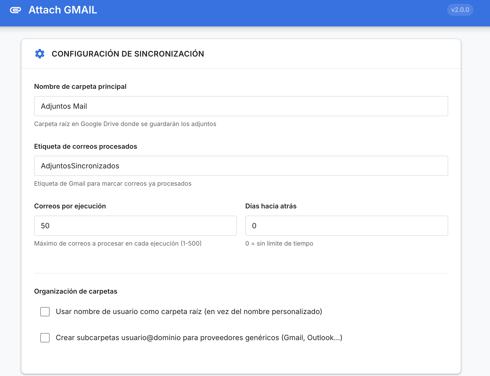
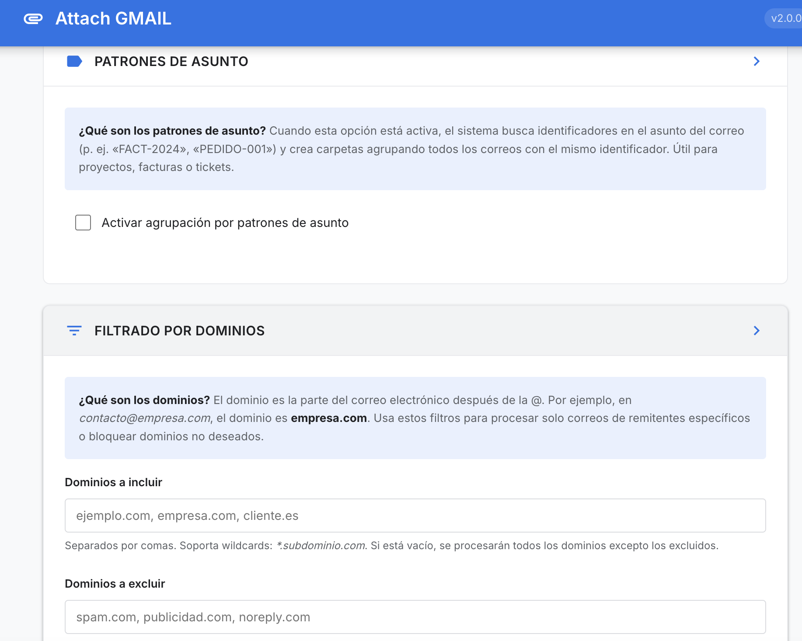
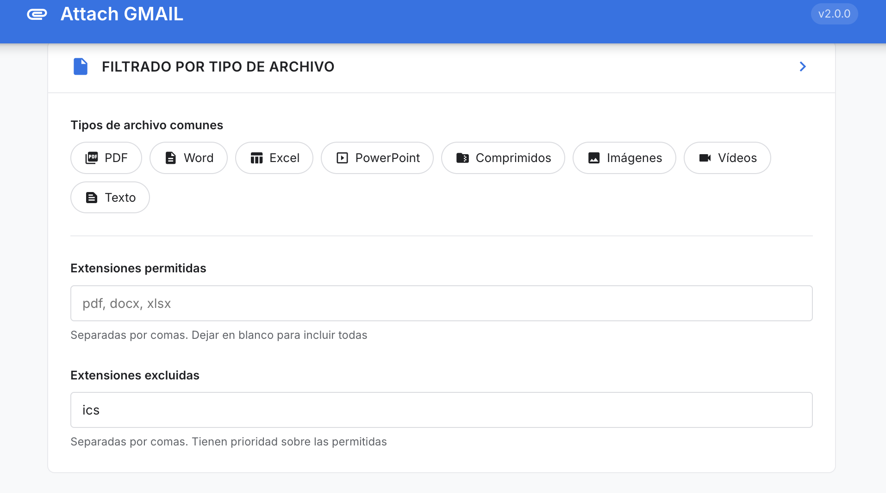
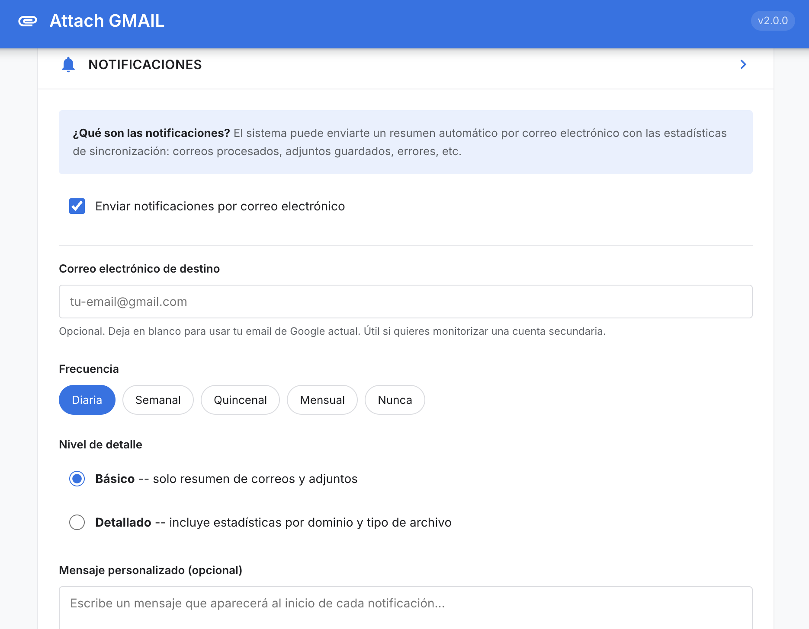
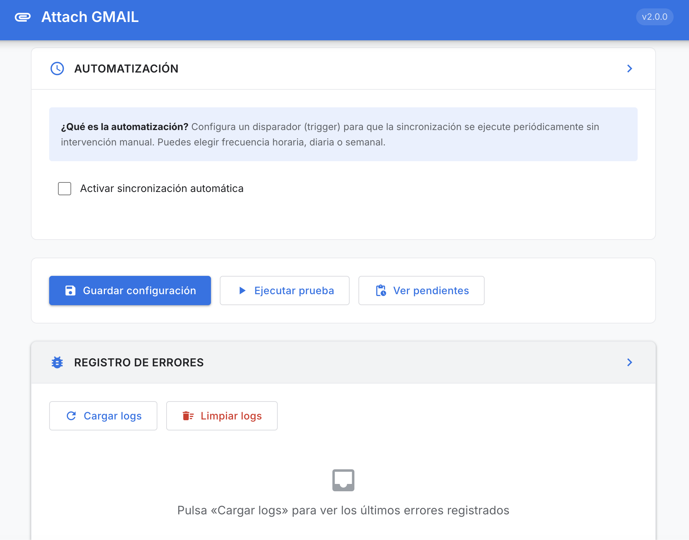

# Attach GMAIL

Sincronización automatizada de adjuntos de Gmail a Google Drive con organización inteligente por dominio del remitente.

**Versión**: 2.0.0 |
**Licencia**: MIT |
**Autor**: [686f6c61](https://github.com/686f6c61)

---

## Descripción

Attach GMAIL es una aplicación desarrollada con Google Apps Script que automatiza la descarga y organización de adjuntos recibidos por correo electrónico en Gmail. El sistema sincroniza los archivos directamente con Google Drive, organizándolos en carpetas jerárquicas según el dominio del remitente, el asunto del correo o el nombre de usuario.

La aplicación se ejecuta de forma autónoma mediante triggers programados (horarios, diarios o semanales), procesando correos de manera periódica sin intervención del usuario. Cada correo con adjuntos se analiza automáticamente: se extrae el dominio, se validan los tipos de archivo según las reglas configuradas, y los archivos se guardan en carpetas organizadas en Google Drive.

La interfaz web permite configurar todos los parámetros desde el navegador, sin necesidad de editar código.

---

## Características

### Sincronización inteligente

- Procesamiento automático de correos con adjuntos.
- Organización por dominio del remitente (`empresa.com/2025-01-15 - Factura enero/factura.pdf`).
- Opción de organizar por nombre de usuario para proveedores genéricos (Gmail, Outlook, etc.).
- Agrupación por patrones de asunto (p. ej. `FACT-2024`, `PEDIDO-001`) para agrupar correos de un mismo proyecto o ticket.
- Detección de duplicados: no vuelve a guardar archivos que ya existen en la carpeta destino.
- Reintentos automáticos con backoff exponencial ante errores de cuota.

### Filtrado avanzado

- **Por dominio**: listas de inclusión y exclusión, con soporte de wildcards (`*.subdominio.com`).
- **Por tipo de archivo**: chips de selección rápida (PDF, Word, Excel, etc.) y listas manuales de extensiones permitidas/excluidas.

### Automatización

- Configuración de triggers directamente desde la interfaz web.
- Frecuencias: horaria (con intervalo configurable), diaria (con hora) o semanal (con día y hora).
- Activación y desactivación sin tocar el editor de Apps Script.

### Notificaciones

- Resúmenes por correo electrónico con las estadísticas de cada sincronización.
- Frecuencia configurable: diaria, semanal, quincenal, mensual o desactivada.
- Dos niveles de detalle: básico (totales) o detallado (desglose por dominio y tipo de archivo).
- Email de destino personalizable (útil para monitorizar cuentas secundarias).
- Mensaje personalizado al inicio de cada notificación.

### Interfaz web

- Panel de configuración completo accesible como webapp de Google Apps Script.
- Diseño limpio con paleta semántica (azul primario, verde para éxito, rojo para errores, ámbar para avisos).
- Secciones colapsables para mantener la interfaz organizada.
- Modal visual para resultados de pruebas (en vez de alertas nativas del navegador).
- Panel de registro de errores con carga y limpieza desde la propia interfaz.
- Responsive: se adapta a escritorio, tablet y móvil.

---

## Capturas de pantalla

### Configuración de sincronización

Carpeta principal, etiqueta de procesados, límites de ejecución y organización de carpetas por usuario.



### Patrones de asunto y filtrado por dominios

Agrupación inteligente por identificadores en el asunto del correo y control de qué dominios se procesan o se ignoran.



### Filtrado por tipo de archivo

Selección rápida con chips y listas personalizadas de extensiones permitidas y excluidas.



### Notificaciones

Resúmenes automáticos por email con frecuencia, nivel de detalle y mensaje personalizado configurables.



### Automatización y registro de errores

Triggers configurables desde la interfaz (horario, diario, semanal) y panel de logs para diagnosticar problemas.



---

## Requisitos

- Cuenta de Google con Gmail y Google Drive.
- Acceso al [editor de Google Apps Script](https://script.google.com).
- Permisos de lectura/escritura sobre Gmail y Drive (se solicitan automáticamente al implementar).

---

## Instalación

### Opción A: desde el editor de Apps Script

1. Abre [script.google.com](https://script.google.com) y crea un proyecto nuevo.
2. Borra el contenido de `Código.gs` que viene por defecto.
3. Crea los archivos del proyecto copiando el contenido de cada fichero del repositorio:
   - `Code.gs` -- punto de entrada y configuración.
   - `Core.gs` -- lógica de procesamiento.
   - `Services.gs` -- interacciones con Gmail, Drive y triggers.
   - `Utils.gs` -- utilidades, validadores y logging.
   - `UI.html` -- interfaz web completa.
4. En **Configuración del proyecto**, verifica que el runtime sea **V8**.
5. Ve a **Implementar > Nueva implementación > Aplicación web**.
6. Configura «Ejecutar como» = *Usuario que accede* y «Quién tiene acceso» = *Solo yo*.
7. Pulsa **Implementar** y acepta los permisos solicitados.
8. Accede a la URL proporcionada para abrir el panel de configuración.

### Opción B: con clasp (línea de comandos)

```bash
# Instalar clasp si no lo tienes
npm install -g @google/clasp

# Autenticarte
clasp login

# Clonar este repositorio
git clone https://github.com/686f6c61/attach-gmail-google-script.git
cd attach-gmail-google-script

# Crear proyecto nuevo en Apps Script
clasp create --title "Attach GMAIL"

# Subir los archivos
clasp push --force

# Abrir en el navegador para implementar como webapp
clasp open
```

---

## Arquitectura del proyecto

```
attach-gmail-google-script/
  Code.gs        Punto de entrada, configuración y funciones expuestas a la UI
  Core.gs        Lógica de sincronización y procesamiento de emails
  Services.gs    Operaciones de Gmail, Drive, notificaciones y triggers
  Utils.gs       Normalización de texto, filtros, validadores y logging
  UI.html        Interfaz web completa (HTML + CSS + JavaScript)
  appsscript.json  Manifiesto del proyecto GAS
```

### Flujo de sincronización

```
syncAttachments()
  |
  +-- cargarConfiguracion()           Lee la config de PropertiesService
  +-- getOrCreateMainFolder()         Crea o recupera la carpeta raíz en Drive
  +-- getOrCreateProcessedLabel()     Crea o recupera la etiqueta de Gmail
  +-- fetchUnprocessedEmails()        Busca correos con adjuntos sin la etiqueta
  |
  +-- Para cada email:
  |     +-- extractDomain()           Extrae dominio del remitente
  |     +-- shouldProcessDomain()     Aplica filtros de inclusión/exclusión
  |     +-- determineTargetFolder()   Decide la carpeta destino (dominio, patrón, usuario)
  |     +-- Para cada adjunto:
  |     |     +-- shouldProcessFileType()  Valida extensión
  |     |     +-- sanitizeFileName()       Normaliza el nombre
  |     |     +-- fileExistsInFolder()     Comprueba duplicados
  |     |     +-- saveFileWithRetry()      Guarda con reintentos
  |     +-- markEmailAsProcessed()    Aplica la etiqueta
  |
  +-- sendSyncNotification()          Envía resumen por email (si procede)
```

---

## Configuración

Toda la configuración se gestiona desde la interfaz web. Los parámetros disponibles son:

| Parámetro | Descripción | Valor por defecto |
|-----------|-------------|-------------------|
| Carpeta principal | Nombre de la carpeta raíz en Drive | `Adjuntos Mail` |
| Etiqueta de procesados | Etiqueta de Gmail para marcar correos ya tratados | `AdjuntosSincronizados` |
| Correos por ejecución | Máximo de correos a procesar en cada ejecución | `50` |
| Días hacia atrás | Limitar la búsqueda a los últimos N días (0 = sin límite) | `0` |
| Dominios incluidos | Solo procesar correos de estos dominios | *(vacío = todos)* |
| Dominios excluidos | Ignorar correos de estos dominios | *(vacío)* |
| Extensiones permitidas | Solo guardar archivos con estas extensiones | *(vacío = todas)* |
| Extensiones excluidas | No guardar archivos con estas extensiones | `ics` |
| Patrones de asunto | Prefijos para agrupar correos por identificador | *(desactivado)* |
| Notificaciones | Envío de resúmenes por email | `Activado, diaria, básico` |
| Automatización | Trigger periódico de sincronización | *(desactivado)* |

---

## Uso

### Sincronización manual

1. Abre la webapp desde la URL de implementación.
2. Configura los parámetros según tus necesidades.
3. Pulsa **Guardar configuración**.
4. Pulsa **Ejecutar prueba** para procesar 5 correos de muestra y verificar que todo funciona.
5. Cuando estés conforme, activa la automatización o ejecuta `syncAttachments()` desde el editor de Apps Script.

### Sincronización automática

1. En la sección **Automatización**, activa la sincronización automática.
2. Elige la frecuencia (horaria, diaria o semanal) y configura los parámetros.
3. Pulsa **Aplicar automatización**.
4. El sistema creará un trigger que ejecutará la sincronización periódicamente.

### Consultar pendientes

El botón **Ver pendientes** muestra cuántos correos quedan por procesar y cuántas ejecuciones se necesitarán aproximadamente para completarlos.

---

## Permisos requeridos

| Permiso | Motivo |
|---------|--------|
| `gmail.modify` | Leer correos y aplicar etiquetas de procesado |
| `gmail.labels` | Crear y gestionar la etiqueta de correos procesados |
| `gmail.send` | Enviar notificaciones por email |
| `drive` | Crear carpetas y guardar archivos adjuntos |
| `script.scriptapp` | Gestionar triggers de automatización |

---

## Solución de problemas

### Los adjuntos no se sincronizan

- Verifica que los permisos están concedidos (reimplementa la webapp si es necesario).
- Comprueba que los filtros de dominio y extensión no estén bloqueando los correos esperados.
- Revisa el **Registro de errores** en la interfaz web.

### Error de cuota excedida

Google Apps Script tiene límites de ejecución. Si procesas muchos correos:

- Reduce el valor de «Correos por ejecución» (p. ej. a 25).
- Configura un trigger horario para procesar en lotes pequeños.
- El sistema reintenta automáticamente ante errores de cuota con backoff exponencial.

### Los correos se reprocesan

- Comprueba que la etiqueta `AdjuntosSincronizados` (o la que hayas configurado) existe en Gmail.
- Si has cambiado el nombre de la etiqueta, los correos anteriores mantendrán la etiqueta antigua.

---

## Contribuir

Las contribuciones son bienvenidas. Para cambios significativos, abre primero un issue para discutir la propuesta.

1. Haz fork del repositorio.
2. Crea una rama descriptiva (`feature/nueva-funcionalidad` o `fix/correccion-bug`).
3. Realiza los cambios y asegúrate de que el código sigue las convenciones del proyecto.
4. Abre un pull request con una descripción clara de los cambios.

---

## Licencia

MIT -- consulta el archivo [LICENSE](LICENSE) para más detalles.

---

## Contacto

- **GitHub**: [686f6c61](https://github.com/686f6c61)
- **Repositorio**: [attach-gmail-google-script](https://github.com/686f6c61/attach-gmail-google-script)
