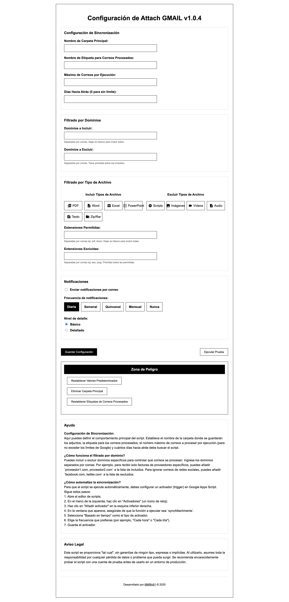

# Attach GMAIL Google Script v1.0.4

## Descripción General

**Attach GMAIL** es un robusto script de Google Apps Script diseñado para la sincronización automatizada de adjuntos de Gmail a Google Drive. El script ofrece un sistema altamente configurable e inteligente para organizar archivos basándose en el dominio del remitente, palabras clave específicas en el asunto del correo y tipo de archivo. Está diseñado para manejar grandes volúmenes de correos de manera eficiente, ofreciendo una solución integral para la gestión de datos y copias de seguridad dentro del ecosistema de Google Workspace.

Esta herramienta es ideal para profesionales, equipos y particulares que necesiten mantener un archivo organizado, accesible y a largo plazo de sus adjuntos de correo.

## Características Principales

- **Organización Inteligente de Archivos**: Clasifica automáticamente los adjuntos en una estructura de carpetas organizada en Google Drive según el dominio del remitente.
- **Filtrado Avanzado**: Control granular sobre qué adjuntos se procesan, con opciones para incluir o excluir dominios y extensiones de archivo específicos.
- **Enrutamiento Basado en Asunto**: Configure patrones personalizados para dirigir adjuntos de correos con líneas de asunto específicas (p. ej., "Factura #123", "Proyecto-X") a carpetas designadas.
- **Ejecución Automatizada**: Programe el script para que se ejecute a intervalos regulares (cada hora, día, semana o mes) utilizando los activadores de Google Apps Script.
- **Notificaciones Configurables**: Reciba resúmenes detallados por correo electrónico después de cada ejecución, con frecuencia y nivel de detalle personalizables.
- **Interfaz de Usuario Web**: Una interfaz limpia y fácil de usar para configurar todos los parámetros del script sin modificar el código fuente.
- **Diseño Idempotente**: El script etiqueta los correos procesados para evitar el procesamiento duplicado, asegurando que cada adjunto se guarde una sola vez.
- **Procesamiento y Reseteo en Lote**: Incluye funcionalidades para resetear las etiquetas de los correos procesados para una resincronización y para gestionar los archivos almacenados directamente desde la interfaz.

## Requisitos Técnicos

- Una cuenta de Google con acceso a Gmail y Google Drive.
- Familiaridad básica con Google Workspace.
- No se requiere experiencia en programación para la instalación y el uso estándar.

## Instalación y Configuración

Siga estos pasos para desplegar y configurar el script:

### 1. Crear un Nuevo Proyecto de Google Apps Script

1.  Vaya al [panel de control de Google Apps Script](https://script.google.com/).
2.  Haga clic en **+ Nuevo proyecto** para abrir el editor de scripts.
3.  Renombre el proyecto a "Attach GMAIL".

### 2. Añadir los Archivos del Script

Necesitará crear dos archivos:

-   **`GmailAttachmentSync.gs`**: El archivo principal del script.
    1.  Elimine el contenido por defecto en `Code.gs`.
    2.  Renombre el archivo a `GmailAttachmentSync.gs`.
    3.  Copie y pegue el contenido completo de `GmailAttachmentSync.gs` de este repositorio en el editor.

-   **`ConfiguracionUI.html`**: El archivo de la interfaz de usuario.
    1.  Haga clic en el icono **+** junto a "Archivos" y seleccione **HTML**.
    2.  Nombre el archivo como `ConfiguracionUI.html`.
    3.  Copie y pegue el contenido completo de `ConfiguracionUI.html` de este repositorio.

### 3. Otorgar Permisos

El script requiere autorización para acceder a sus datos de Gmail y Google Drive.

1.  En el editor de scripts, seleccione la función `doGet` en el menú desplegable y haga clic en **Ejecutar**.
2.  Aparecerá un cuadro de diálogo solicitando autorización. Haga clic en **Revisar permisos**.
3.  Elija su cuenta de Google.
4.  Verá una advertencia de "Google no ha verificado esta aplicación". Haga clic en **Configuración avanzada** y luego en **Ir a Attach GMAIL (no seguro)**.
5.  Revise los permisos solicitados y haga clic en **Permitir**.

### 4. Desplegar como Aplicación Web

Desplegar el script como una aplicación web proporciona una URL estable para acceder a la interfaz de configuración.

1.  Haga clic en **Implementar** > **Nueva implementación**.
2.  Seleccione **Aplicación web** como tipo de implementación.
3.  Configure la implementación:
    -   **Descripción**: `Attach GMAIL v1.0.4`
    -   **Ejecutar como**: `Yo (su-email@gmail.com)`
    -   **Quién tiene acceso**: `Solo yo`
4.  Haga clic en **Implementar**. Copie la URL de la aplicación web generada para futuros accesos.

## Configuración

Toda la configuración se gestiona a través de la interfaz web. Abra la URL de la aplicación web o ejecute la función `doGet` desde el editor para acceder a la interfaz.

### Ajustes de Sincronización

-   **Nombre de Carpeta Principal**: La carpeta raíz en Google Drive donde se almacenarán todos los adjuntos.
-   **Nombre de Etiqueta**: La etiqueta de Gmail que se aplicará a los correos procesados para evitar la resincronización.
-   **Máximo de Correos por Ejecución**: El tamaño del lote para cada ejecución. Recomendado: 50-100 para evitar exceder los límites de tiempo de ejecución de Google.
-   **Días Hacia Atrás**: El período de tiempo para escanear correos. Establezca en `0` para no tener límite de tiempo.

### Filtrado

-   **Filtrado por Dominios**: Use listas separadas por comas para especificar qué dominios incluir o excluir. Las exclusiones tienen prioridad.
-   **Filtrado por Tipo de Archivo**: Use la interfaz interactiva para seleccionar qué extensiones de archivo permitir o bloquear.

### Automatización

Para ejecutar el script automáticamente, configure un activador:

1.  En el editor de Apps Script, vaya a la pestaña **Activadores** (icono de reloj).
2.  Haga clic en **+ Añadir activador**.
3.  Configure el activador de la siguiente manera:
    -   **Función a ejecutar**: `syncAttachments`
    -   **Implementación**: `Principal`
    -   **Fuente del evento**: `Basado en tiempo`
    -   **Tipo de activador basado en tiempo**: Elija la frecuencia que desee (p. ej., `Temporizador por horas`, `Temporizador por días`).
4.  Haga clic en **Guardar**.

## Seguridad y Privacidad de Datos

-   El script opera completamente dentro de su cuenta de Google.
-   Sus datos no se transmiten a ningún servicio de terceros.
-   El código fuente es completamente auditable.

Para más detalles, revise el archivo [SECURITY.md](SECURITY.md).

## Licencia

Este proyecto está licenciado bajo la Licencia MIT. Consulte el archivo [LICENSE](LICENSE) para más detalles.

---

Desarrollado por [686f6c61](https://github.com/686f6c61).